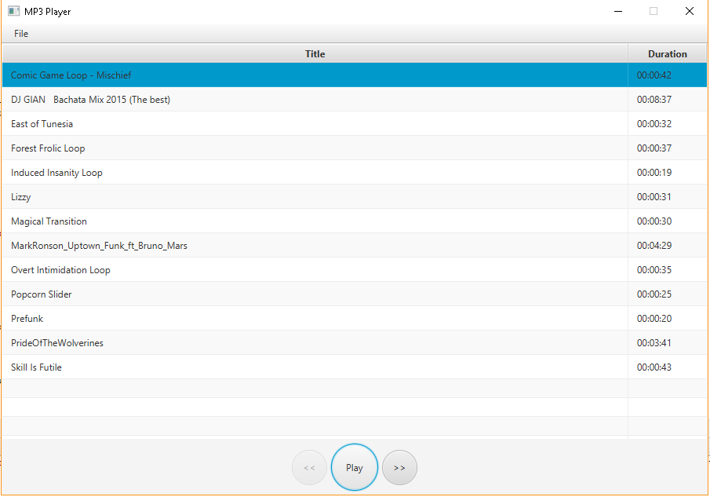

# Mp3Player
Personal Project to pass the time and get some practice

## Author
* **Jose Cruz** - [Joseavel](https://github.com/joseavel)

## How to run

Make sure you have the latest java JDK con your computer. Copy the files and folders provided to a location on your computer. Open your prefered command line interpreter (I prefer Command Prompt)  change to the directory you've placed the previously mentioned files. Run the following commands to compile the source code and run the program:

```
javac *.java
java Main
```

#### Features (so far)
A file menu bar with the following choices : 
- coming soon

A display section for the songs with the following features:
- you are able to see the name and duration of each song
- you are able to click the song you want to play

A play button:
- allows you to play and pause a song.

A next button
- allows you to play the next song.

A previous button
- allows you to play the previous song.

### Visual


